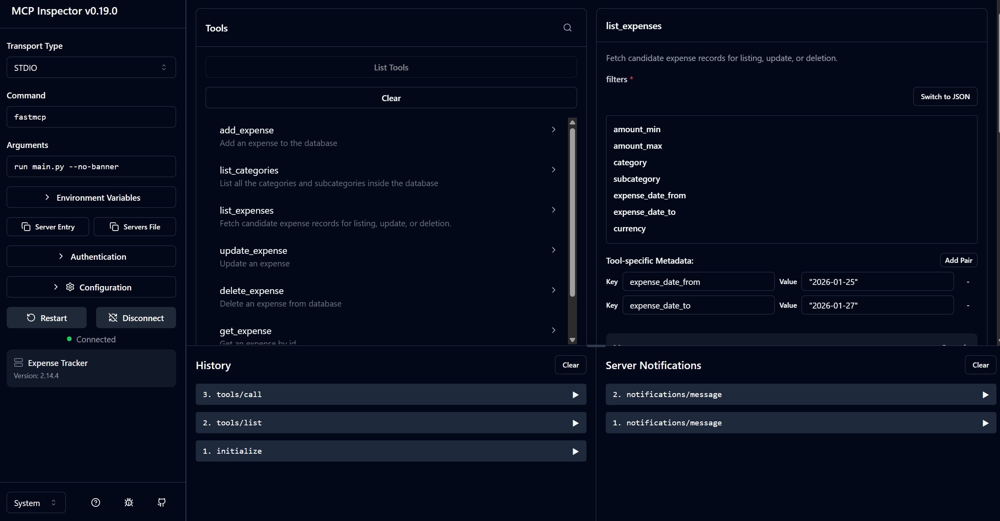

# Expense Tracker MCP

A FastMCP-based server for managing personal expenses, with full CRUD operations and currency conversion support. Designed to integrate with Claude Desktop or other LLM clients.

---

## Features

- **Add Expense** – Record expenses with date, amount, category, subcategory, description, and currency.
- **List Categories** – Retrieve all unique categories and optionally their subcategories.
- **List Expenses** – Filter expenses by amount, category, subcategory, date range, or currency.
- **Update Expense** – Update existing expense records using their IDs.
- **Delete Expense** – Delete an expense record by ID.
- **Get Expense** – Fetch a single expense record by ID.
- **Currency Conversion** – Convert amounts between supported currencies on the fly.
- **Categories Resource** – Retrieve predefined expense categories and subcategories dynamically.

## Supported Currencies

```plaintext
INR, AED, CAD, EUR, MYR, SEK, USD, AUD, CHF, GBP, JPY, PHP, SGD, ZAR, BRL, CNY, HKD, MXN, SAR, THB
```

---

## MCP Inspector



## Database Setup

1. Start SQLShell (psql) and login as postgres

   ```bash
   psql
   ```
2. Create User, Database, and Privileges. Please change the password.

   ```pgsql
   -- Create the user 
   CREATE USER expense_user WITH PASSWORD 'your_password';

   -- Create the database with this user as owner
   CREATE DATABASE expense_db OWNER expense_user;

   -- Connect to the new database
   \c expense_db

   -- Grant schema privileges (expense_user already owns the database, but this ensures they can create objects)
   GRANT ALL PRIVILEGES ON SCHEMA public TO expense_user;

   -- For future tables/sequences created by ANY user, grant access to expense_user
   ALTER DEFAULT PRIVILEGES IN SCHEMA public GRANT ALL ON TABLES TO expense_user;
   ALTER DEFAULT PRIVILEGES IN SCHEMA public GRANT ALL ON SEQUENCES TO expense_user;
   ```
3. Clone the repository

   ```bash
   git clone https://github.com/i0Ta07/MCP.ExpenseTracker
   ```
4. Install uv and sync dependencies.

   ```bash
   pip install uv
   uv sync
   ```

# Running the MCP Server

1. Create the .env file. Make sure to change the password.

```
DBNAME="expense_db"
USER="expense_user" 
PASSWORD="your_password" 
```

2. Run with MCP Inspector

```bash
uv run fastmcp dev main/main.py
```

### Integration with Claude

If you directly want to integrate with claude. Don't create the .env file just pass the envirnment variables like below.Add the following configurations in you claude_desktop_config.json. Make sure to change the password.

```json
{
  "mcpServers": {
      "Expense Tracker": {
      "command": "uv",
      "args": [
        "run",
        "--with",
        "fastmcp,psycopg2-binary",
        "fastmcp",
        "run",
        "Absolute/path/to/your/main.py/file"
      ],
      "env": {
  	"DB_NAME": "expense_db",
  	"DB_USER": "expense_user",
  	"DB_PASSWORD": "your_password",
  	"DB_HOST": "localhost",
  	"DB_PORT": "5432"
      }
    }
  }
}
```

### Future Updates

- Add recurring expense table.
- Add a boolean column for credit or debit transactions.
- Convert the whole code from synchronous to asynchronous.
- Add authenitcation and then deploy on cloud.
- Add summary functions.
- Add budget table (monthly, quaterly, half-yearly and yearly)
- Configure Docker for local server.
